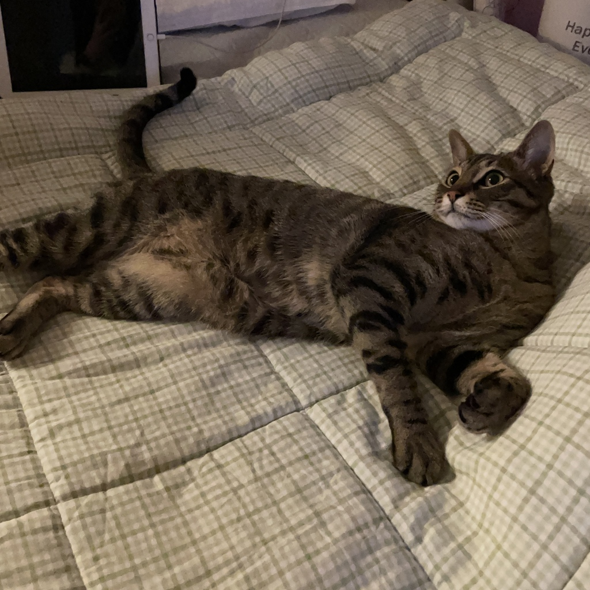

# 호두의 랜딩 페이지

#### 프로젝트 소개


- 본 프로젝트는 ‘호두의 랜딩 페이지’를 주제로 한 웹페이지 구현을 목표로 제작되었습니다.

- 데스크톱 환경을 우선으로 설계하였으며, 미디어 쿼리를 활용해 모바일 화면(max-width: 768px)까지 최적화된 반응형 레이아웃을 구현하였습니다.

- 시멘틱 마크업과 접근성, SEO 등 웹 품질 요소를 고려하여 제작하였습니다.

#### 관련 링크

- **[배포 URL 🔗](https://891km.github.io/hodu-landing-page/)**

- **[시연 영상 🎞️](https://youtu.be/whpIWQ6GTIw)**

#### 작성자 및 개발자

- 김민주

<br>

## 요구사항 명세

| 번호 | 요구사항 내용                                       | 비고            |
| ---- | --------------------------------------------------- | --------------- |
| 1    | 피그마를 참고하여 페이지 구현                       | 디자인 준수     |
| 2    | 시멘틱, 반응형, 접근성, SEO, CSS 네이밍 방법론 고려 | 품질 기준       |
| 3    | 모바일 화면 고려하여 구현                           | 반응형 적용     |
| 4    | 스크롤 시 헤더 고정 구현                            | UI 및 기능 구현 |
| 5    | 구독하기 모달창 퍼블리싱 후 화면에서 숨김 처리      | 기능 데모       |

<br>

## 프로젝트 구조

```
📂
├─ .gitignore
├─ index.html
├─ README.md
├─assets
│  ├─icons
│  └─images
└─styles
    ├─ main.css
    ├─ mobile.css
    └─ reset.css
```

<br>

## 주요 고려 사항

### 1. 반응형 최적화

#### 1-1. CSS 변수를 통한 반응형 스타일 관리

- 컨텐츠의 최대 너비가 1280px를 넘지 않고, 최소 4rem로 유지하게 위해 `padding`에 `max()` 함수를 컨텐츠의 너비를 조절하였습니다.

- `clamp()` 함수를 사용하여 `font-size`와 `border-radius`가 뷰포트에 따라 유동적으로 적용되도록 구현하였습니다.

- 공통적으로 사용되는 값들을 CSS 변수로 정의하여 스타일 통일과 유지관리를 용이하게 하였습니다.

  ```css
  :root {
    /* padding */
    --padding: max(4rem, calc((100% - 1280px) / 2));

    /* font-size */
    --fs-heading-lg-fluid: clamp(2.4rem, 4.8vw, 4.8rem);
    --fs-heading-md-fluid: clamp(2.4rem, 2.4vw, 3.6rem);
    --fs-body-md: 1.6rem;
    --fs-body-sm: 1.4rem;
    --fs-body-caption: 1.2rem;

    /* card style */
    --card-radius: clamp(1.8rem, 3vw, 3rem);
    --card-shadow: 1rem 1rem 3rem 0 rgba(0, 0, 0, 0.25);
  }
  ```

#### 1-2. 자연스러운 레이아웃 변화

- `flex`을 사용하여 화면 너비에 따라 레이아웃이 자연스럽게 배치되도록 디자인하였습니다.
- 데스크톱과 모바일 미디어 쿼리 간의 매끄러운 화면 전환을 구현하였습니다.

### 2. 접근성 고려

#### 2-1. 다운로드 버튼에 툴팁 추가

- 'download' 버튼에 `::after` 가상요소를 이용하여 버튼의 역할과 다운로드 파일명을 안내하는 툴팁 스타일링을 추가하였습니다.
  

#### 2-2. 포커스 스타일 적용

- 입력 필드, 링크, 버튼 요소에 명도가 높은 컬러를 사용하여 '포커스 스타일'을 적용하여 사용자가 쉽게 인지할 수 있도록 하였습니다.

  ```css
  input:focus,
  :is(button, a):focus-visible {
    outline: 0.4rem solid #ff4000;
    outline-offset: 0.1rem;
  }
  ```

### 3. 이미지 최적화

- `<picture>` 태그를 사용해 `webp` 형식의 이미지와 미디어 쿼리에 따라 크기가 다른 이미지가 로드되도록 구현했습니다.

  ```html
  <picture>
    <source srcset="./assets/images/intro-cat-1280px.webp" type="image/webp" />
    <source
      srcset="./assets/images/intro-cat-768px.webp"
      media="screen and (max-width: 768px)"
      type="image/webp"
    />
    
  </picture>
  ```

### 4. 스타일 컴포넌트화

- 반복되는 ‘제목-설명’ 구조에 공통 클래스를 부여하여 기본 스타일을 적용하고, 선택자를 통해 섹션별로 개별 스타일을 덮어썼습니다.
- `.text-container`로 기본 틀을 설정하고, 섹션별 차이를 위해 `.section-banner .text-container {...}` 같은 형태의 선택자를 사용하여 개별 스타일을 추가 및 변경하였습니다.

  ```css
  .text-container {
    text-align: left;
    display: flex;
    flex-direction: column;
    justify-content: start;
    align-items: start;
    gap: 4rem 0;
  }

  .section-banner .text-container {
    flex: 1 1 auto;
    min-width: 45rem;
    padding-top: 20rem;
  }
  ```

### 5. 스크롤바 스타일링

- 이미지 리스트의 가로 스크롤바가 hover 시에만 표시되도록 처리해 디자인을 유지하였습니다.
- 스크롤바의 스타일링을 통해 디자인 통일감을 주었습니다.
- 크로스 브라우징을 고려한 스크롤바 스타일링 코드를 추가하였습니다.

  ```css
  /* for standard */
  .section-skills .image-list {
    scrollbar-width: auto;
    scrollbar-color: transparent transparent;
  }

  .section-skills .image-list:hover {
    scrollbar-color: #d976524c transparent;
  }

  /* for legacy */
  .section-skills .image-list::-webkit-scrollbar {
    width: 0.6rem;
    height: 1.2rem;
    background-color: transparent;
  }

  .section-skills .image-list::-webkit-scrollbar-thumb {
    background-color: transparent;
  }

  .section-skills .image-list:hover::-webkit-scrollbar-thumb {
    background-color: #d976524c;
    border-radius: 0.4rem;
  }
  ```

<br>

## 에러와 에러 해결

### 1. 반응형 레이아웃 조정

#### 1-1. 문제 정의

- `form` 요소 내 입력 필드와 버튼이 데스크톱 화면에서는 가로로 나란히 배치되어야 하지만, 모바일 화면에서는 버튼이 아래로 분리되어 배치되어야 하는 문제가 있었습니다.

#### 1-2. 문제 해결

- 이메일 입력 필드를 감싸는 `<div class="input-wrapper">`를 추가하고 `::before`를 이용하여 이메일 아이콘을 추가하여 레이아웃 관리가 용이하도록 HTML 구조를 수정하였습니다.
- 데스크톱 화면에서는 `form`에 `display: flex`를 적용하여 가로로 배치하였고, 모바일 화면에서는 `flex-direction: column;`으로 변경하여 버튼이 아래에 위치하도록 하였습니다.
- 기존 `form`에 적용했던 배경 스타일을 `.input-wrapper`로 옮겨 버튼이 분리된 것처럼 보이게 하였습니다.

  ```html
  <form action="#" method="post">
    <!-- ::before 가상 요소로 이메일 아이콘 추가 -->
    <div class="input-wrapper">
      <input
        type="email"
        name="email"
        placeholder="Enter your e-mail address"
      />
    </div>
    <button
      class="btn"
      id="btn-open-modal"
      type="button"
      aria-label="블로그 구독 신청하기"
    >
      Subscribe
    </button>
  </form>
  ```

### 2. `<dialog>` 태그와 `display` 속성 문제

#### 2-1. 문제 정의

- 요소의 가운데 정렬을 위해 `<dialog>` 태그에 `display: flex`를 적용하자 모달이 닫히지 않는 문제가 있었습니다.

#### 2-2. 문제 해결

- `<dialog>` 태그에는 `display` 속성을 제거하고, 하위 컨테이너에 `display: flex`와 `margin` 속성을 적용하여 레이아웃을 조정하여 문제를 해결하였습니다.

<br />

## 회고

### Liked (좋았던 점)

- 코드 리뷰를 통해 고민했던 점에 대한 답을 확인할 수 있었고, 구체적인 개선점을 알게 되어 큰 도움이 되었다.

### Learned (배운 점)

- 실습을 통해 `flex` 속성에 대한 이해도가 높아졌다.
- `clamp()`와 `max()` 같은 CSS 함수의 활용을 익힐 수 있었다.
- 개발 뿐만 아니라, 문서 작성과 커뮤니케이션 측면에서도 경험을 쌓을 수 있었다.
- Mac 환경에서 화면이 훨씬 깔끔하게 보였으며, Windows와 Mac 환경에서 모두 확인해 보는 게 좋을 것 같다.

### Lacked (부족했던 점)

- 버튼 hover 스타일과 포커스 스타일이 겹처서 시각적으로 개선해야 할 부분이 있었다.

### Long for (바라는 점)

- 페이지 구조를 먼저 파악한 후 작업을 시작하면 개발 속도가 더 빠를 것 같다.
- 이미지 파일명을 처음부터 정리하고 시작하는 편이 좋을 것 같다.
